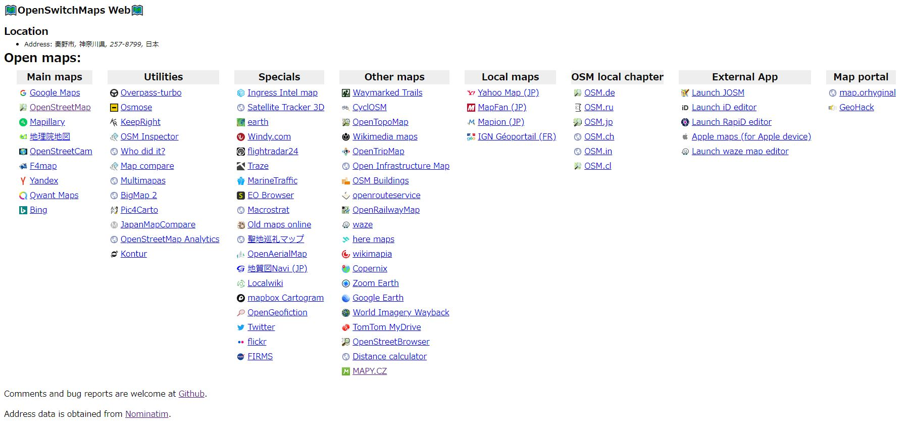

# OpenSwitchMapsWeb
Web version of [OpenSwitchMaps](https://github.com/tankaru/OpenSwitchMaps).

# Why not browser extension?
Web browser extension "OpenSwitchMaps" is available for Chrome and Firefox. You can switch maps via browser menu. I tried to add more and more map services, but a too much expanded menu lost its usability. So I decided to make a web version to add map services as much as I want.

## How to use
1. Bookmark this bookmarklet
```javascript:(function(){ window.location.href="https://tankaru.github.io/OpenSwitchMapsWeb/index.html#"+location.href;})();```
1. Open Map service
1. Open saved Bookmarklet
1. You will move to a web page. And you will get links to map services


